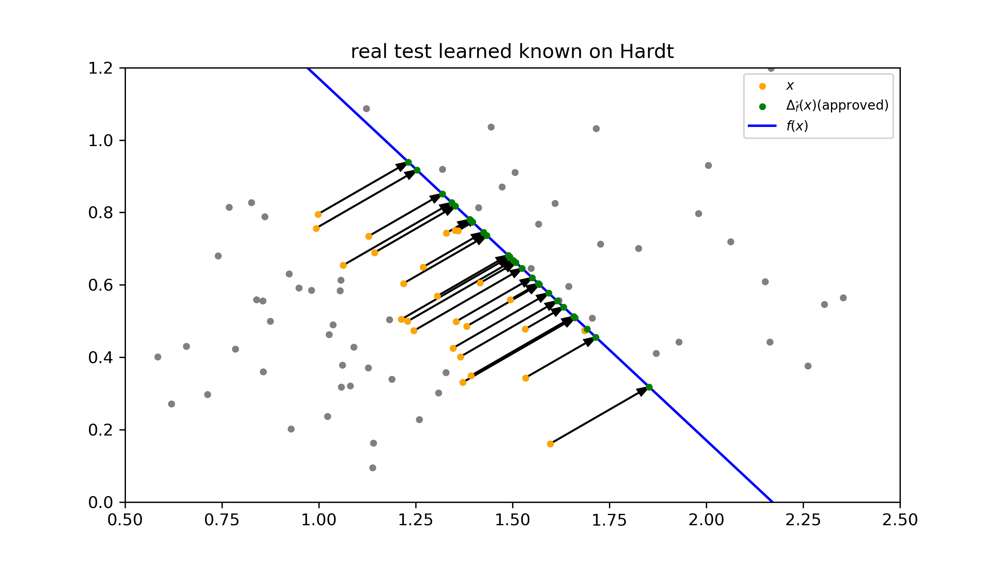
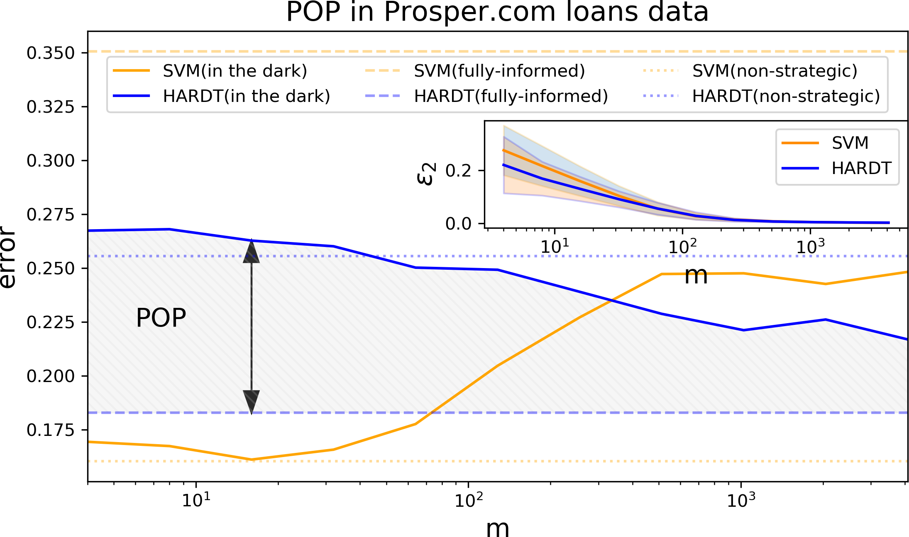
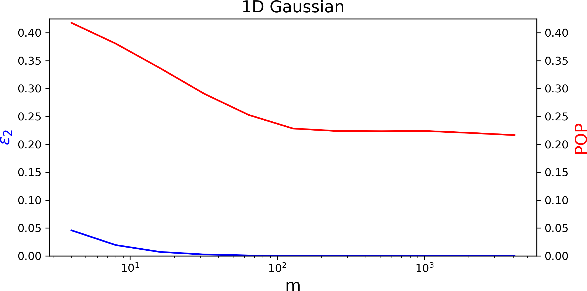

# Strategic classification in the dark: paper code
This is the code for the paper Strategic Classification in the Dark.

Installation instructions:

Create new environment and use the requirements.txt file to install all packages.
You can use the following line:
  
      conda create -n strategic_dark python=3.9
      
      conda activate strategic_dark
      
      pip install -r requirements.txt

There are three main experiment in the paper and you can run them:

**1) full information experiment**. That means Contestants know the classifier. In this experiment you can see the
different between Hardt's model (the model that describes in Strategic Classification) and the linear svm model.

Running the experiment:

    python strategic_main_run.py --full_info_exp

**2) Movements in the dark experiment**. That means Contestants don't know the classifier. In this experiment you 
can see how the number of sample Contestant learns from, influences Hardt's model and svm model results.
**Note: for running this experiment you should run first experiment number 1 with the same e and c parameters**
At the end of this experiment you can find the output files at:
 result/dark_exp/cost_factor=_{what you defined}_epsilon={epsilon}
 In this folder you can find:
 Graphs with models errors
 Plots of constants movements
 Summaries files about the experiment.  

Running the experiment:

    python strategic_main_run.py --dark_exp

**3) Run synthetic experiment in one dimension.** Points are sampled from Gaussian Distribution.
 
 Running the experiment:
 
    python strategic_main_run.py --synthetic_exp

#### **Flags::**
     -c: This is the scale of the cost Contestant pays for movement. Default value is 5. Only relevant in the full information and dark experiments.
      
     -e: This is epsilon the weight of the l2 cost function in the total cost Contestant has to pay for movement. Default value is 0.2. 
        Only relevant in full information and dark experiments.
     
     -s: The safety that player takes in order to ensure that it gets positive classification. Used only in dark experiment default value is 0
     
     -th: If set hardt model will train again
     
     -ts: Train svm loan return model. Only relevant in the full information and dark experiments.
     
     -cv: Only if train svm loan is set
     
     --list: List of the the numbers examples that Contestants can learn from. Only relevant in experiments
      dark and synthetic 1 dimension Gaussian.
      
      -ns: Number of Hardt's model to use in the synthetic experiment
      
      -rp: Number to repeat the synthetic experiment
      
      -trs: Number of examples to train the Hardt's model. If this number is greater than the train set we use all the train set
      (in the synthetic experiment there is no limitation to the number of examples to train).
      
      -tes: Number of examples in the test set that tries to achieve positive score on the model.
      
      -mp: Shows the plot of the player movements.
      
      --save: Saves some information about Contestant trained models. The data of this experiment is saved in:
                                       result/dark_exp/cost_factor={cost_factor}_epsilon={epsilon}. Please note that it might take a lot of storage but
                                       some of the data might speed up the next dark experiment.
                                       One is svm_result/f_hat_result folder and the other is hardt_results/f_hat_result_folder.
                    
      
 
  **Example:**

     python strategic_main_run.py --full_info_exp -c 5 -e 0.2
 

